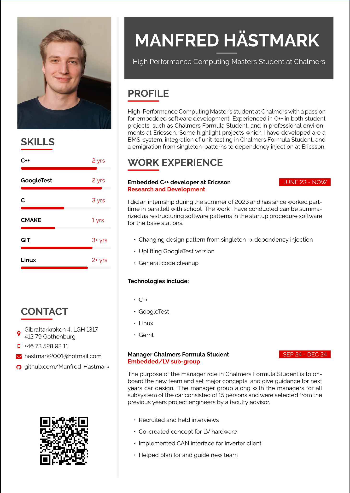

# Resume

This repository contains the source latex files for my resume. The template I created my resume from 
is forked from the [latexcv](https://github.com/jankapunkt/latexcv) repository, from which I used the *sidebarleft*-template.
The actual resume can be found [here](sidebarleft/main.pdf) and below you can see a preview of the first page.



## How to build (docker)?

We now have a Dockerfile you can use to build your latex environment. 
For this you need to have Docker installed on your system.

Get Docker: https://docs.docker.com/get-docker/

We provide scripts for building the image and running the containers, 
so you should fine by simply running the `build.sh` script:

```shell
$ .docker/create_image.sh
```

You should now be able to build CVs simply by providing the folder name:

```shell
$ .docker/build.sh classic
```

Constraints: You need to be in the top-level folder of this project and the image has been created (see prior step).

## License

The MIT License (MIT)

Copyright (c) 2014-2021 Jan Küster

Permission is hereby granted, free of charge, to any person obtaining a copy
of this software and associated documentation files (the "Software"), to deal
in the Software without restriction, including without limitation the rights
to use, copy, modify, merge, publish, distribute, sublicense, and/or sell
copies of the Software, and to permit persons to whom the Software is
furnished to do so, subject to the following conditions:
	
THE SOFTWARE IS PROVIDED "AS IS", WITHOUT WARRANTY OF ANY KIND, EXPRESS OR
IMPLIED, INCLUDING BUT NOT LIMITED TO THE WARRANTIES OF MERCHANTABILITY,
FITNESS FOR A PARTICULAR PURPOSE AND NONINFRINGEMENT. IN NO EVENT SHALL THE
AUTHORS OR COPYRIGHT HOLDERS BE LIABLE FOR ANY CLAIM, DAMAGES OR OTHER
LIABILITY, WHETHER IN AN ACTION OF CONTRACT, TORT OR OTHERWISE, ARISING FROM,
OUT OF OR IN CONNECTION WITH THE SOFTWARE OR THE USE OR OTHER DEALINGS IN
THE SOFTWARE.

